# Gwilym Llywelyn

## Introduction

Link to deployed site can be found [Here]()

Github last commit [here]()

# Purpose

To create a functional website for the documentary photographer Gwilym Llywelyn to showcase his previous project work. The website will have distinct portfolio and shop sections as this follows the design layout of many artist's websites.

# UX
## User stories
## As Admin:
* I can manage users' accounts so that I can make any required changes to them if needed
* I can make new galleries and upload new images to the galleries
* I can manage products in the shop (add , update or delete products)
* I can view created orders to fulfil or edit them
* I can view messages sent via contact form and can act upon them

## As a site user:
* Before logging in:
	* I can browse photo galleries
	* I can search for products so that I can find specific products
	* I can sort products on criteria such as name and category so that I can I have a method of ordering the products products as I prefer
	* I can browse through products so that I can decide what I may be interested in buying
	* I can look at product details to find out more about the product
	* I can easily add products I want to purchase to a basket
	* I can view the contents of my shopping basket so that I can be able to make any adjustments
	* I can update my bag by adding more or remove products so that I can decide on the number of products I intend to buy
	* I can view my order summary so that I can verify it before confirming
	* I can checkout securely so that I can I maintain the level of trust on the site
	* I can use the contact form so that I can contact the site owners
* After logging in:
	* I can add gallery images to my favouries
	* I can save my personal details after making a purchase
	* I can create or edit my account to update my details
	* I can login in my account so that I can view my order history

## Architecture

## Database

#### __Database Plan__

| Key | Name | Type |
| --- | --- | --- |
| | `Checkout` |
|  | `Order` |  |
| ForeignKey | user_profile | UserProfile |
|  | date | DateTimeField |
|  | order_number | CharField |
|  | delivery_cost | DecimalField |
|  | order_total | DecimalField |
|  | grand_total | DecimalField |
|  | full_name | CharField |
|  | email = | EmailField |
|  | phone_number | CharField |
|  | street_address1 | CharField |
|  | street_address2 | CharField |
|  | city_or_town | CharField |    
|  | postcode = | CharField |
|  | county = | CharField |
|  | country | CountryField |
|  | original_bag | TextField |
|  | stripe_pid | CharField |
|  | `OrderLineItem` |
| ForeignKey | order | Order |
| ForeignKey | prints | Prints |
|  | prints_size | CharField |
|  | quantity | IntegerField |
|  | lineitem_total | DecimalField |
|  | `Profiles` |
|  | `UserProfile` |
| OneToOneField | user | User |
|  | default_email | EmailField |
|  | default_phone_number | CharField |
|  | default_street_address1 | CharField |
|  | default_street_address2 | CharField |
|  | default_city_or_town | CharField |  
|  | default_postcode | CharField |
|  | default_county | CharField |
|  | default_country | CountryField |
|  | `Superuser` |
|  | Username | TextInput |
|  | Email address | TextInput |
|  | Password | TextInput |
| `Projects` |
|  | `Project` |
|  | Name(unique) | TextInput|
|  | Description | TextInput |
|  | Where | TextInput |
|  | When | DateTimeField |
| `Photos` |
| ForeignKey | project | Project |
|  | name | CharField |
|  | friendly_name | CharField |
|  | image_url | URLField |
|  | image | ImageField |
|  | description | TextField |
|  | Name(unique) | TextInput |
|  | Image |  |
| ForeignKey | project_name | Project Model |
| `Shop` |
|  | `Category` |
| ForeignKey | name | Project |
|  | `Prints` |
| ForeignKey | name(unique) | Photo |
| ForeignKey | category |  Category |
|  | sku | CharField |
|  | friendly_name | CharField |
|  | image_url | URLField |
|  | image | ImageField |
|  | description | TextField |
|  | a4_price | DecimalField |
|  | a5_price | DecimalField |
|  | `PriceSelectionForm`|
|  | selected_price | ChoiceField |

## Design

### Color Scheme

I have chosen to keep the webpage mostly white like gallery walls. This is to draw attention to the work and not to distract the user. This was a joint decision with the artist. I chose the dark earthy green for the logo as I felt this would compliment the earthy tones in his landscape pictures.

### Font Choices 

I wanted to contrast a modern font, which I've used for the headings with traditional fonts for the logo and the paragraphs. 

!(logo)[media/docs/logo-font.png]
!(heading)[media/docs/heading-font.png]
!(paragraph)[media/docs/paragraph-font.png]

### Wireframes

  
Click here to view Wireframes:

	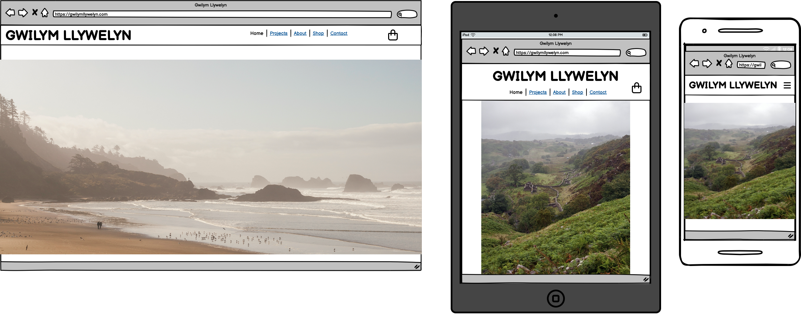
	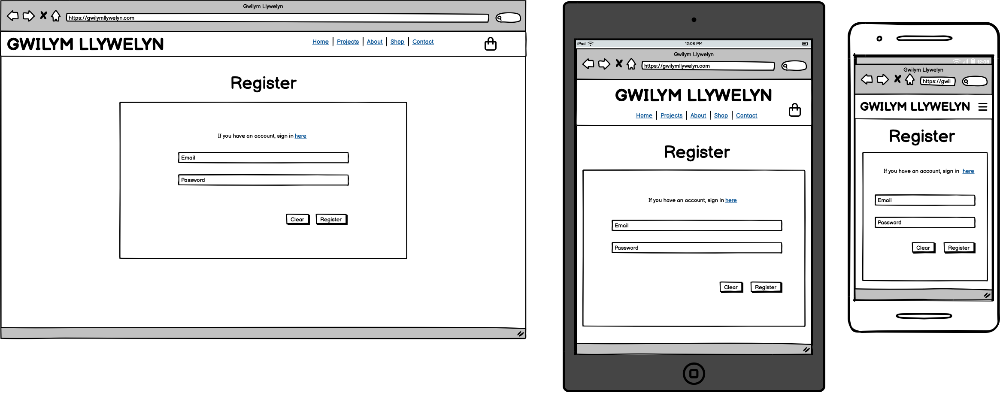
	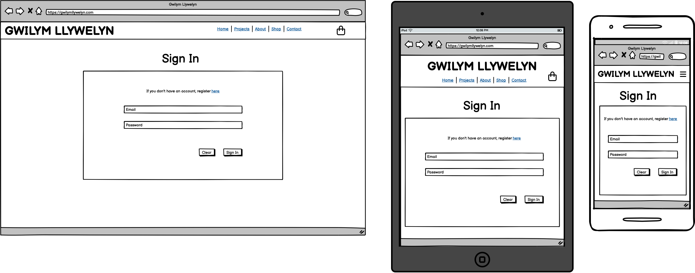
	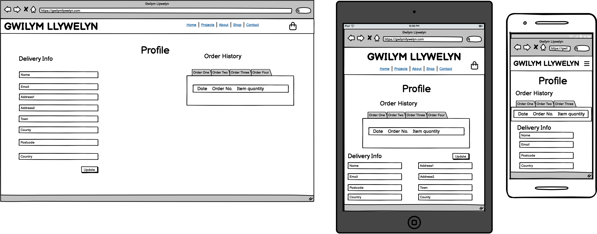
	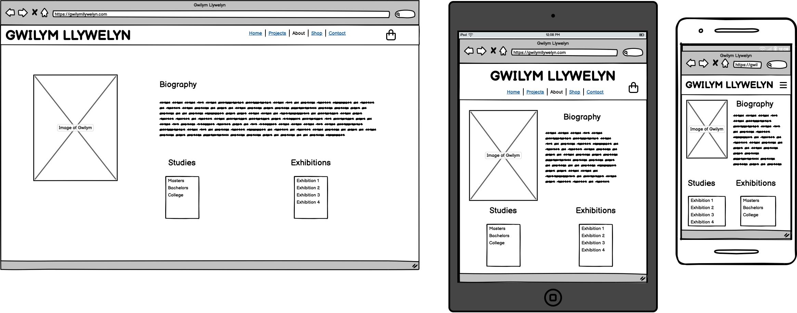
	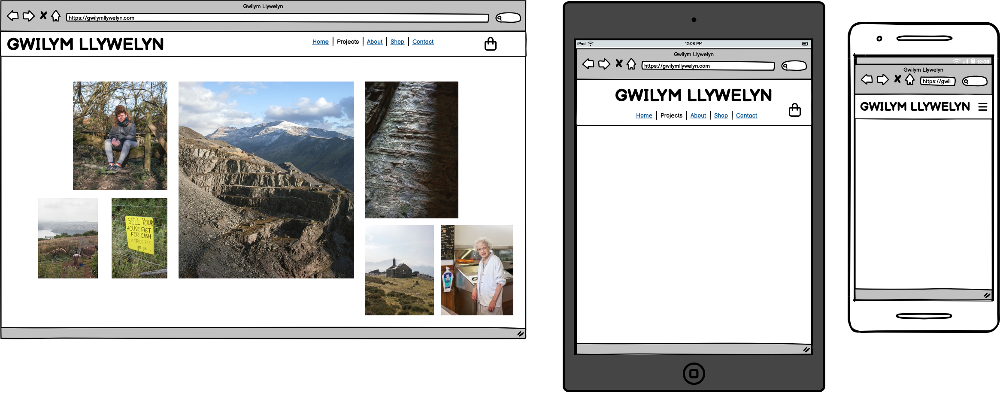
	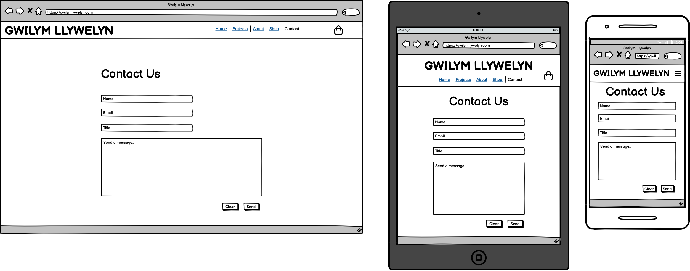

## Features

### Navigation and Footer

The navigation features a collapsible main nav, and a logo and user icons that wrap on smaller screens. The footer contains image copyright and social media icons.

### The home page

A bootstrap carousel rotates between different images. A portrait or landscape iamge will show depending on screen size.

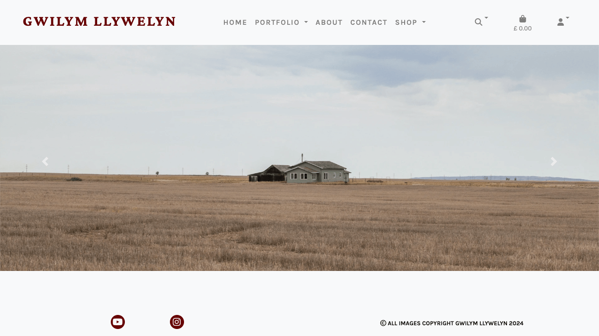

### Register/Sign up

Allauth was used to create the login and signup processes. If on the signup page there is a login page link and vice versa.

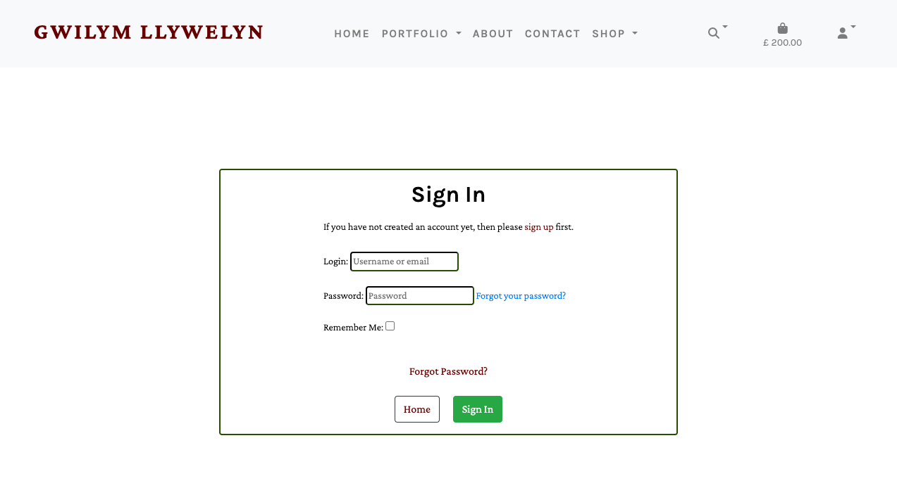

## Portfolio

### View Project

Each project has a homepage of different images on cards in a responsive grid. If an image is clicked on a fancybox responsive gallery with zoom and navigation to other images.

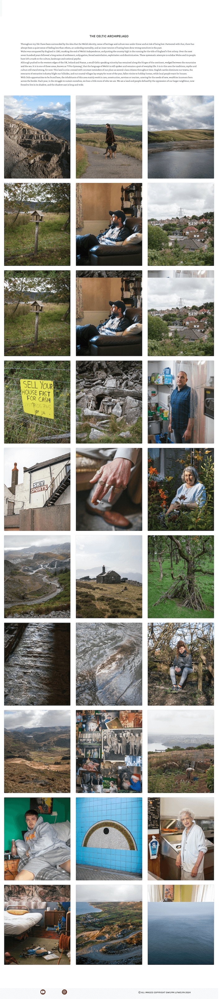

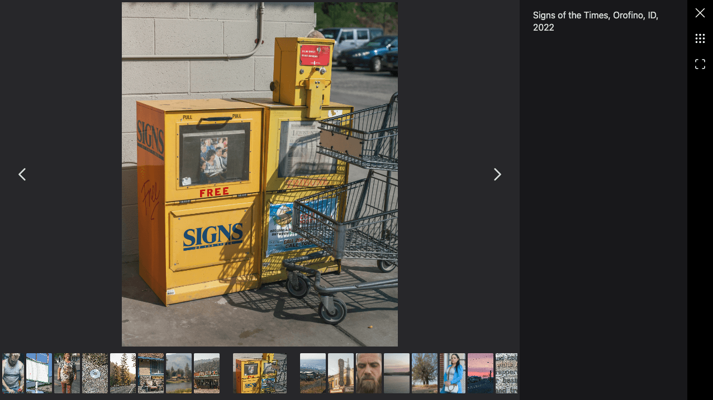

### Project Admin

The project admin pages have links to edit and delete all the photos and projects in the database. There are also buttons that link to the forms to add projects and photos.  The admin user can click on edit and delete on the cards to edit the photo information from the admin page. The admin user can also use the project table to be taken to the project edit forms.

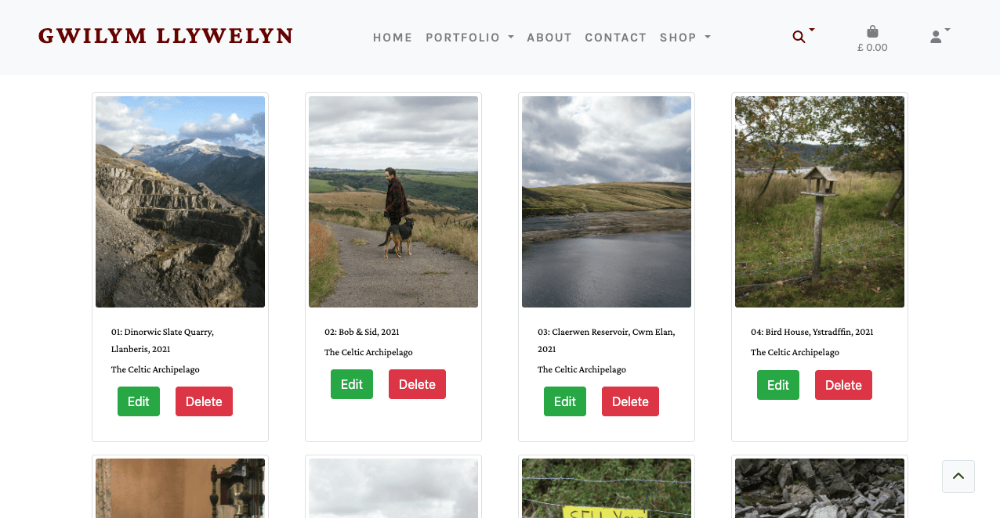

## All Prints

All the prints are displayed in a responsive grid on cards with information about the prints. If the image is clicked on it links to the print info page. On the prints page there are category filters and a reset button as well as filters to sort the prints aphabetically by name or category.

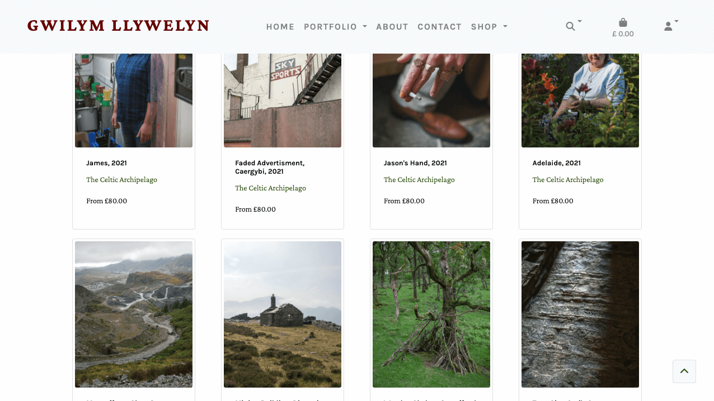

### Print Info

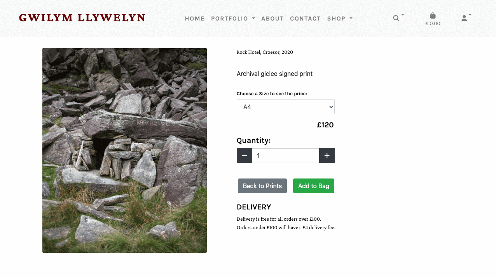

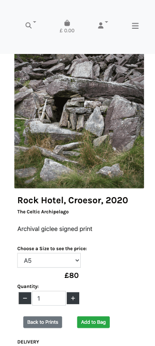

### Shop Admin

The Shop admin pages have links to edit and delete all the prints and cateogires in the database. There are also buttons that link to the forms to add cateogires and prints. The admin user can click on edit and delete on the cards to edit the prints from the admin page. The admin user can also use buttons on the print info page to update these. There is a category table that can be used to update cateogry information.

### The shopping bag

The shopping bag is responsive and has tools to update the quantity of an item or remove it. There are buttons linking to the checkout page.

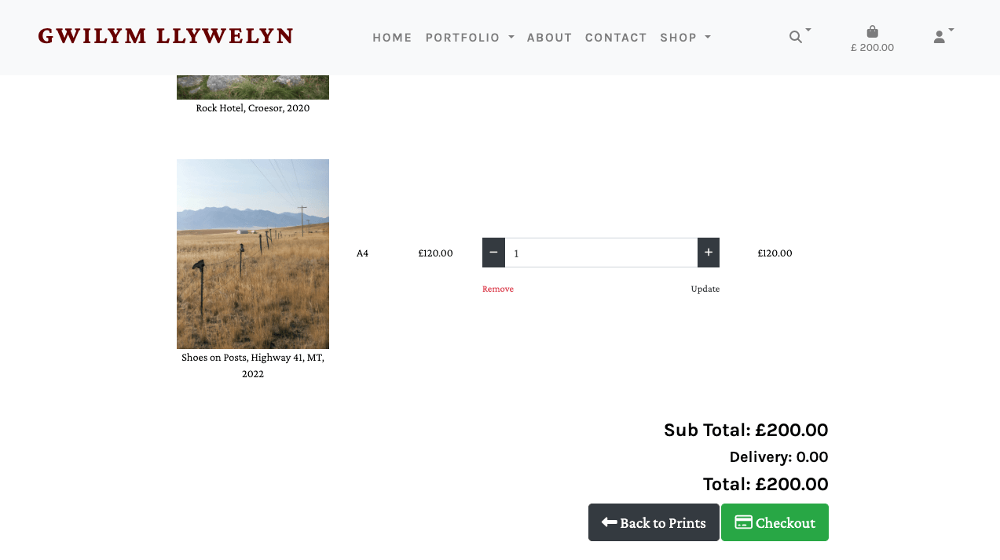

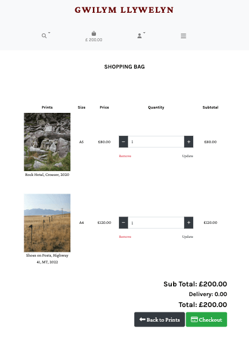

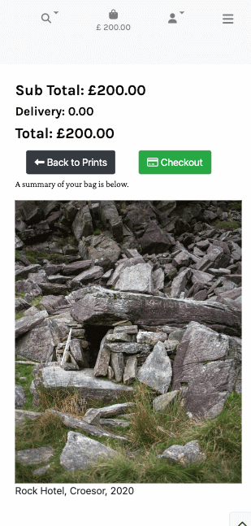

### Checkout

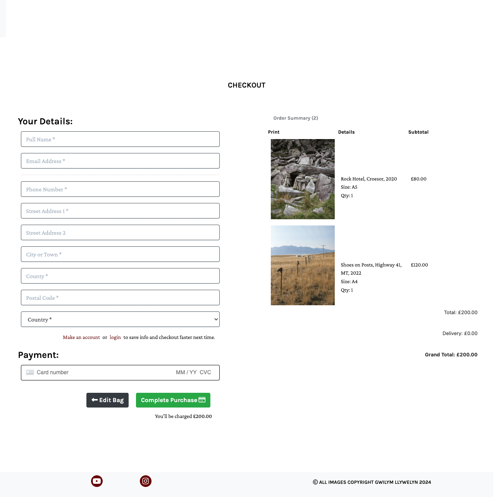

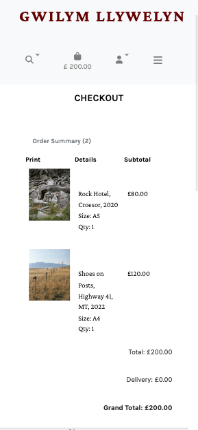

### Checkout success

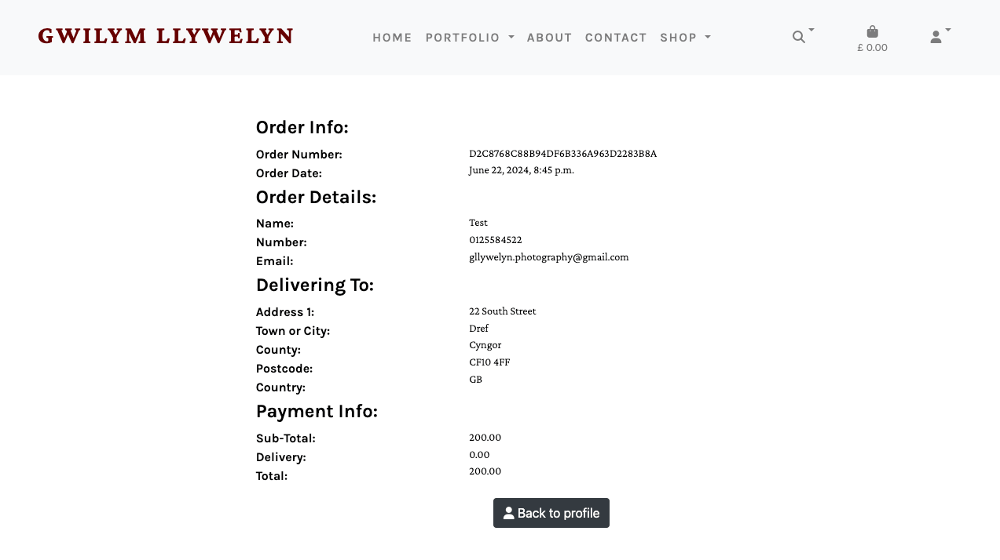

The checkout success page has information about the order. An order confirmation email is sent to the email provided when the Stripe payment has processed.

# Delete confirmation - all items

# My Profile

The profile page has order history information and a form to update personal details. These will autofill at checkout.

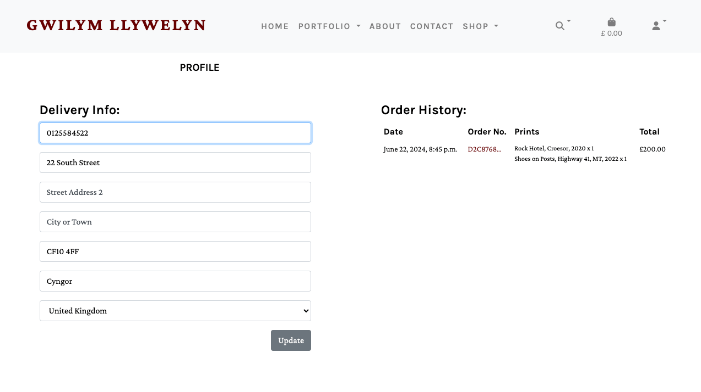

# 404 page

### Future features

### Future Implementations

- 
- 
- 

### Accessibility

I used accessability features to make the website accessible for a variety of users. Features include:
- Use of semantic HTML
- Aria-labels on all buttons and links
- All pages of a suitable contrast as advised by WebAIM
- Descriptive alt attributes
- providing aria labels for icons without text

- - -

## Technologies Used

### Languages Used

HTML, CSS, JavaScript, Python

- - -

### Databases Used

[PostgreSQL](https://www.postgresql.org/) 

[ElephantSQL](https://www.elephantsql.com/) - Database hosting for deployed site

- - -

### Frameworks Used

[Django](https://www.djangoproject.com/) - Django is a high-level Python web framework that encourages rapid development and clean, pragmatic design.

[Bootstrap4](https://getbootstrap.com/) - A css framework

[Fancybox](https://fancyapps.com/fancybox/) - A JS framework

- - -

### Libraries & Packages Used

[SQLAlchemy](https://pypi.org/project/SQLAlchemy/) - Database abstraction library, used to interact with PostgreSQL.

[Font Awesome](https://fontawesome.com/) - Was used to add icons for my social media links.

- - -

### Programs Used

[Heroku](https://www.heroku.com/) - is a cloud platform service  I used to deploy and host the project

[Pip](https://pypi.org/project/pip/) - Tool for installing python packages.

[Stripe](https://stripe.com/en-ie) - was used for checkout functionality and facilitate online payments

[AWS](https://aws.amazon.com/s3/) - for  object storage through a web service interface.

[Balsamiq](https://balsamiq.com/) - Used to create wireframes.

[Figma](https://www.figma.com/) - To make flow charts.

[Git](https://git-scm.com/) - For version control.

[Github](https://github.com/) - To save and store the files for the website.

[Google Fonts](https://fonts.google.com/) - To import the fonts used on the website.

[Google Chrome Dev Tools](https://developer.chrome.com/docs/devtools/) - To troubleshoot and test features, solve issues with responsiveness and styling.

[Tiny PNG](https://tinypng.com/) To compress images for use in the readme.

[Any webP](https://www.anywebp.com/) To resize images and convert to webP format for the site.

[Favicon.io](https://favicon.io/) To create the favicon.

[Am I Responsive?](http://ami.responsivedesign.is/) To show the website image on a range of devices.

### Error Handling

### Defensive Programming

#### User

I have used "@login_required" to prevent users from accessing some pages. This prevents those not logged in from accessing the admin pages.

#### Admin User

I have used if statements in the templates to prevent non-superusers from accessing the admin pages.

I have set up AWS to prevent others from accessing keys and being able to write to the media and static buckets.

# Deployment

The site has been developed using Gitpod workspaces and Github for version control. It was deployed to Heroku using the following steps:

* Log in to [Heroku](https://id.heroku.com/login), using two factor authentication
* Click New and Create New App
* Choose a name and select the closest reigon
* Click Create App

Create a database to store the website data:

* Login to [ElephantSQL](https://www.elephantsql.com/)
* Create new instance
* Set up your plan - Give the plan a name and select Tiny Turtle free plan
* Choose the closest reigon (EU-West-1(Ireland))
* Click Review
* Click Create instance
* Return to elephantsql dashboard, click on database instance name
* In the url section, clicking the copy icon will copy the database url to the clipboard
* Go back to Heroku to your created app, go to Settings
* Add config var DATABASE-URL, and for the value, copy in your databse url from ElephantSQL
* In Gitpod install dj-database_url and psycopg2 to connect to your external database
* Update requirements.txt: pip freeze > requirements
* import dj_database_url in settings and update your database
* migrate your database
* create a new superuser for your database (do not push to github until complete)
* Install gunicorn and freeze into the requirements file
* Then create Procfile and add config var DISABLE_COLLECTSTATIC=1
* Commit and push to github
* Use the CLI to connect the repo to heroku and deploy, set automatic deployment
* When complete click View to open the deployed app

## From Github docs

### Forking 

* Open GitHub page that hosts the repository you wish to fork.
* Find the 'Fork' button at the top right of the page
* Once you click the button the fork will be in your repository

### Cloning

* Open Go to the repository page on Github
* click on the green button that says "Code".
* You can choose to download a zip file of the repository, unpack it on your local machine, and open it in your IDE.
* Copy the URL under the HTTPS tab to clone using https.
* In a new window, and set the current directory to the one you want to contain the clone from.
* Type git clone and paste the URL copied from the GitHub page.
* The repository clone will now be created on your machine. 

## Credits

* All images belong to Gwilym Llywelyn.

### Acknowledgement and support

Thank you to Gwilym for allowing me to use his photos to create an attractive website.

Thank you to the Code Institute tutors, mentors and cohort managers for the support to build a full stack project.
